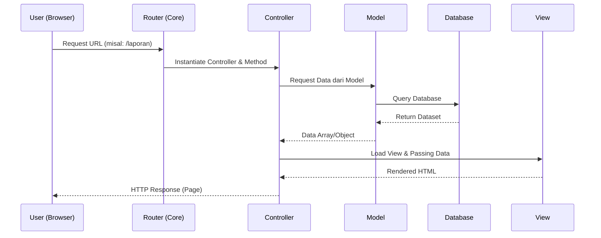

# ARSITEKTUR SISTEM JAGAPADI
## Panduan Teknis Struktur dan Alur Data Aplikasi

Dokumen ini menjelaskan arsitektur perangkat laku yang digunakan oleh JAGAPADI, termasuk pola desain, struktur folder, dan alur kerja inti.

***

## 1. POLA ARSITEKTUR: CUSTOM MVC

JAGAPADI menggunakan pola arsitektur **Model-View-Controller (MVC)** yang dibangun secara kustom untuk memberikan keseimbangan antara performa tinggi dan kemudahan pemeliharaan.

### Komponen Utama:
- **Models**: Menangani logika bisnis dan akses database (PDO). Terletak di `app/models/`.
- **Views**: Presentasi data kepada pengguna menggunakan template PHP/HTML. Terletak di `app/views/`.
- **Controllers**: Jembatan antara Model dan View, memproses input pengguna. Terletak di `app/controllers/`.
- **Core**: Kernel aplikasi (Router, Base Controller, Session) yang menangani routing dan siklus hidup request.

***

## 2. STRUKTUR DIREKTORI

```
jagapadi/
├── app/                  # Inti aplikasi
│   ├── controllers/      # Logika aplikasi per modul
│   ├── core/             # Base classes (Router, Model, Controller)
│   ├── helpers/          # Fungsi utilitas (Security, Date, Excel)
│   ├── models/           # Interaksi database
│   ├── services/         # Logika eksternal (Scraper, API Integrator)
│   └── views/            # File template UI
├── config/               # Konfigurasi sistem dan database
├── database/             # Script SQL dan file migrasi
├── public/               # File yang dapat diakses publik
│   ├── assets/           # Gambar, ikon, dan dokumen static
│   ├── css/              # Stylesheets kustom
│   ├── js/               # Scripts frontend (Maps, Charts)
│   └── uploads/          # Folder penyimpanan foto laporan
├── docs/                 # Dokumentasi teknis (Dokumen ini)
└── index.php             # Front Controller (Entry Point)
```

***

## 3. ALUR KERJA REQUEST (DATA FLOW)

Sistem menggunakan **Single Entry Point** melalui `index.php`. Berikut adalah alur proses dari request hingga response:



***

## 4. INTEGRASI API EXTERNAL (SIMITRA)

JAGAPADI terintegrasi dengan API Simitra untuk sinkronisasi data mitra dan kegiatan.

- **Service**: `app/services/SimitraService.php` (Jika ada) atau ditangani via Helper.
- **Proses**: 
  1. Kontroler memicu sinkronisasi.
  2. Service melakukan cURL request ke endpoint Simitra dengan Token Auth.
  3. Respons JSON didekode dan disimpan ke tabel `kegiatan_simitra` dan `mitra_simitra`.

***

## 5. SISTEM PELAPORAN BERBASIS KOORDINAT

Aplikasi menangkap data lokasi (Latitude & Longitude) untuk setiap laporan hama.

1. **Input**: Petugas memasukkan koordinat melalui form atau GPS device.
2. **Storage**: Disimpan sebagai tipe `DECIMAL` di database.
3. **Visualization**: Library `Leaflet.js` di View menarik data JSON dari endpoint `dashboard/map` dan merendernya sebagai marker di peta interaktif.

***

> [!TIP]
> Untuk pengembangan lanjutan, selalu gunakan Base Controller `Controller.php` untuk memastikan session handling dan view rendering yang konsisten.
