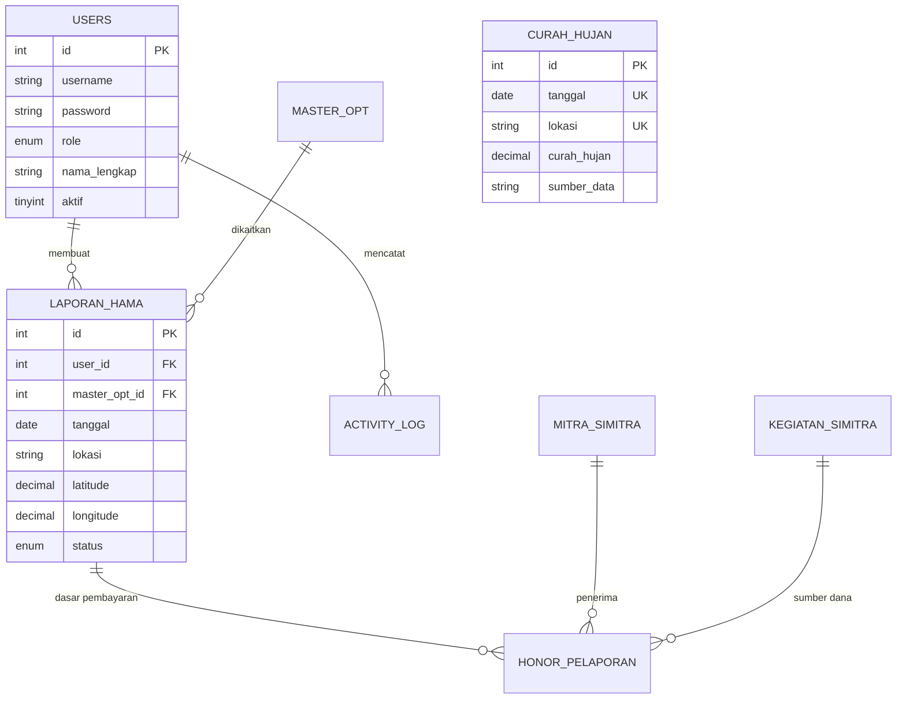

# STRUKTUR DATABASE JAGAPADI
## Dokumentasi Skema, Tabel, dan Relasi

Dokumen ini memberikan rincian teknis mengenai struktur database MySQL yang digunakan oleh aplikasi JAGAPADI.

***

## 1. DATA ENTITY RELATIONSHIP (ERD)

Aplikasi memiliki beberapa modul inti yang saling berhubungan melalui foreign key.

***

## 2. DETAIL TABEL INTI

### 2.1 Tabel: `users`
Menyimpan data kredensial dan profil pengguna.

| Field | Tipe | Null | Key | Default | Deskripsi |
|-------|------|------|-----|---------|-----------|
| `id` | INT | NO | PK | AI | ID unik user |
| `username` | VARCHAR(32) | NO | UNI | | Username login |
| `password` | VARCHAR(128) | NO | | | Hash password (BCRYPT) |
| `role` | ENUM | NO | | | admin, operator, viewer, petugas |
| `aktif` | TINYINT | YES | | 1 | Status akun aktif/nonaktif |

### 2.2 Tabel: `laporan_hama`
Menyimpan data laporan serangan hama dari lapangan.

| Field | Tipe | Null | Key | Default | Deskripsi |
|-------|------|------|-----|---------|-----------|
| `id` | INT | NO | PK | AI | ID unik laporan |
| `user_id` | INT | YES | FK | | Referensi `users.id` |
| `master_opt_id`| INT | YES | FK | | Referensi `master_opt.id` |
| `status` | ENUM | YES | | Draf | Draf, Submitted, Diverifikasi, Ditolak |
| `latitude` | DECIMAL(10,8) | YES | | | Koordinat Lintang |
| `longitude` | DECIMAL(11,8) | YES | | | Koordinat Bujur |

### 2.3 Tabel: `curah_hujan`
Menyimpan data monitoring curah hujan harian.

| Field | Tipe | Null | Key | Default | Deskripsi |
|-------|------|------|-----|---------|-----------|
| `id` | INT | NO | PK | AI | ID unik data |
| `tanggal` | DATE | NO | UK | | Tanggal observasi |
| `lokasi` | VARCHAR(100) | YES | UK | Jember | Lokasi observasi |
| `curah_hujan` | DECIMAL(10,2) | NO | | | Nilai (mm) |

***

## 3. INDEKS & OPTIMASI

Sistem menggunakan indeks pada kolom-kolom yang sering digunakan dalam pencarian dan filter:
- `idx_tanggal` pada `laporan_hama` dan `curah_hujan`.
- `unique_tanggal_lokasi` pada `curah_hujan` untuk mencegah duplikasi data.
- Foreign Keys pada `laporan_hama` memastikan integritas referensial data OPT dan User.

***

## 4. KEAMANAN DATA

- **Hashing**: Semua password pengguna disimpan menggunakan algoritma `BCRYPT` (sebelumnya MD5, telah dimigrasi di v2.2.1).
- **Sanitasi**: Input database diproses menggunakan `PDO Prepared Statements` untuk mencegah SQL Injection.

***

> [!IMPORTANT]
> Jangan melakukan perubahan skema secara langsung di database production. Gunakan file migrasi di folder `database/migrations/` atau script SQL yang terdokumentasi di `database/schema.sql`.
